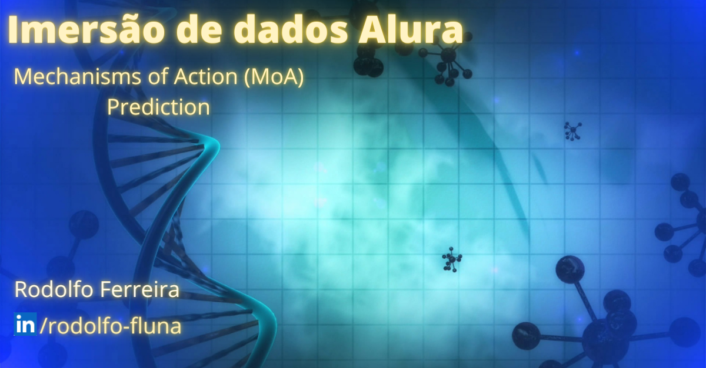

# Desafio Final Imersão de Dados

  

## Objetivo

  O objetivo desse trabalho é a criação de um modelo de machine learning capaz de predizer, com base nos dados(assinatura), se a substância administrada ativa algum mecanismo de ação.
  
 ## Dataset
 
  A base de dados é de um desafio do Kaggle criado pela Universidade de Harvard, com dados de diversos compostos testados que combinam expressões genéticas e viabilidade celular tendo como objetivo testar novas drogas.
  
## Análise dos dados
  Para a criação do modelo, iremos analisar o dataset fornecido utilizando linguagem python e bibliotecas para manipulação de dados como pandas e numpy, visualização dos dados com matplotlib e seaborn para extrair informações que sirvam como base para a criação do modelo.
  
## Entendendo as variáveis

  Nos dados temos as colunas:
  
  id: Identificação de cada experimento.
  tratamento: Informa se o teste foi com droga ou com controle.
  tempo: Tempos de administração das substâncias, que foram divididos em 24, 48 e 72h.
  dose: Dose maior ou menor aplicada.
  droga: contendo o identificador único da substância utilizada.
  g-0 até g771: Dados da expressão genética.
  c-0 até c-99: Dados da viabilidade celular.
  
  Nos dados dos resultados, temos o id do experimento e 206 colunas com os mecanismos contendo valor 0 ou 1 informando a ativação do mecanismo(1) ou não(0).
  
## Referências
  
https://pt.wikipedia.org/wiki/Ensaios_de_viabilidade_celular

https://www.kaggle.com/c/lish-moa/discussion/191487

https://pt.wikipedia.org/wiki/Express%C3%A3o_g%C3%A9nica
